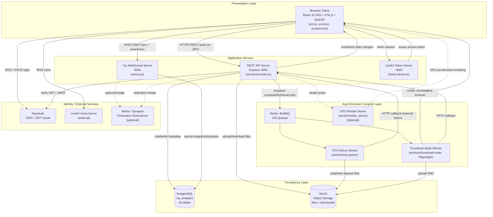

# CIA Web — System Architecture (Research Documentation)

> **Scope and method.** This document was produced by direct inspection of the
> `CIA_Web` repository — entry points, route handlers, service modules,
> database schema, worker processes, and deployment manifests (`docker-compose.yml`,
> `webpack.config.js`, `package.json`). It describes the system **as
> implemented**, not as advertised in the README. Statements that could not be
> directly confirmed in code are explicitly marked **[inferred]**; everything
> else is traceable to a specific file path cited in §5.

---

## 1. System Architecture Overview

CIA Web (Collaborative Immersive Analytics) is a multi-process, multi-protocol
system for real-time, multi-user exploration of 3D/2D scientific datasets
across desktop and VR (WebXR) clients. Rather than a single monolithic
server, the implementation is organized as **five independently deployable
process groups** that communicate over HTTP(S), WebSocket, and a Redis-backed
job queue, coordinated around two shared data stores (PostgreSQL, MinIO).

**1.1 Presentation layer — Browser Client.** A single-page application built
with React 18 and Webpack (`src/`), responsible for UI rendering, 3D/2D
scientific visualization via VTK.js, and WebXR-based virtual reality
interaction. The client has no server-side rendering; the "embed" entry point
(`src/embed.js`) is a stripped-down variant used only for headless thumbnail
capture by a worker process, not for end users. Internally, the client is
layered as **UI components → services → managers → core (event bus,
state) → utilities**, a dependency direction enforced by convention across
`src/ui`, `src/services`, `src/core`, and `src/utils`.

**1.2 Application layer — REST API server.** An Express.js HTTP server
(`server/src/index.js`, port 3001) exposing 29 resource-oriented route
modules (datasets/files, annotations, views, workspaces, rooms, compute jobs,
recordings, VR sessions, GPU status, etc.). It is the system of record for
all persistent domain data and enforces authorization via Keycloak-issued JWTs
or a development bypass header. It owns a secondary, non-CRDT WebSocket
channel used only to broadcast REST-driven state changes to connected
clients, distinct from the Y.js layer below.

**1.3 Real-time collaboration layer — CRDT synchronization server.** A
second, independently deployed Node process (`server.js`, port 9001)
implements the Y.js sync/awareness protocol over WebSocket. It exists
specifically to give ephemeral, high-frequency collaborative state (cursor
positions, avatar poses, live camera/manipulator transforms, chat) low-latency
conflict-free replication without funnelling every mouse-move through the REST
API. It persists periodic snapshots and updates back to PostgreSQL through a
dedicated persistence service, and is architecturally isolated from the REST
API process even though both ultimately read/write the same database — a
deliberate separation between *transactional CRUD* and *streaming CRDT sync*
responsibilities.

**1.4 Asynchronous compute layer.** Long-running or CPU/GPU-bound operations
(mesh decimation, point-cloud processing, isosurfacing, VR dataset
preprocessing, thumbnail rendering) are not executed inline in the API
process. They are queued as BullMQ jobs backed by Redis and consumed by
out-of-process workers: a Python worker (`workers/vtk-python`) for VTK/scikit-learn/UMAP
compute, and a Node worker (`workers/thumbnail-node`) that drives a headless
browser to render view thumbnails. Workers report results back to the API via
an internal HTTP callback endpoint authenticated with a shared internal
token, rather than writing to the database directly. A separate GPU render
backend (`server/render_server`) provides accelerated rendering when the
NVIDIA-enabled Docker Compose override is used, and is health-checked through
`/api/gpu/status`.

**1.5 Persistence layer.** PostgreSQL is the authoritative relational store
(project/workspace/dataset/annotation/view metadata, room membership, VR
session state, Y.js document snapshots, audit and sync-event logs). MinIO
provides S3-compatible object storage for uploaded dataset files and
generated thumbnails. Redis is scoped narrowly to job-queue transport (BullMQ)
and is not used as a general cache or session store.

**1.6 Identity and federation layer.** Authentication is delegated to
Keycloak (OIDC/JWT, PKCE authorization-code flow on the client). Two optional
subsystems extend the platform without being on the critical path of core
functionality: a LiveKit-based voice layer, integrated directly from the
browser client with token issuance from a small standalone token server
(not part of the main API process); and an optional Matrix/Synapse federation
bridge that mirrors collaboration chat/room state into a federated Matrix
homeserver, toggled off by default via an environment flag.

Taken together, the architecture reflects a **CQRS-like split**: durable,
authoritative state flows through the REST API and PostgreSQL; ephemeral,
latency-sensitive collaborative state flows through the Y.js WebSocket layer;
and expensive computation is offloaded to a queue-driven worker pool — three
concerns that could otherwise have been conflated into a single server
process.

---

## 2. Architecture Diagram (ASCII)

```
                                   +--------------------------------------------+
                                   |              BROWSER CLIENT                |
                                   |   React 18 SPA (Webpack) + VTK.js + WebXR   |
                                   |   src/ui  src/core  src/services  src/vr   |
                                   +----+---------------+---------------+-------+
                                        |               |               |
                       HTTPS (REST)     |   WSS (CRDT)  |   WSS (voice) |
                                        |               |               |
              +-------------------------+   +-----------+   +-----------+---------------+
              |                             |                                           |
              v                             v                                           v
   +----------------------+     +-------------------------+                +------------------------+
   |     REST API SERVER    |   |   Y.JS WEBSOCKET SERVER  |                |   LIVEKIT VOICE SERVER  |
   |  server/src/index.js   |   |        server.js         |                |   (external, token via  |
   |     Express : 3001     |   |          :9001           |                |    token-server.js)     |
   |  routes/*  middleware/ |   |  CRDT sync + awareness   |                +------------------------+
   |  auth (Keycloak/JWT)   |   |  yjsPersistence.js       |
   +----+---------+---------+   +------------+-------------+
        |         |                          |
        |         |     (shared DB)          |
        |         +--------------------------+
        |                        |
        v                        v
   +----------+          +----------------+
   |  MinIO   |          |   PostgreSQL   |
   | (files,  |<---------|  cia_analytics |
   | thumbs)  |  reads   |  44 tables     |
   +----+-----+  writes  +----------------+
        ^                        ^
        |                        |
        |     +------------------+-------------------+
        |     |                                       |
        |     v                                       v
   +----+-----------------+                 +---------------------+
   |   REDIS (BullMQ)     |                 |      KEYCLOAK        |
   |  job queues only     |                 |  OIDC / JWT issuer   |
   +----+--------+--------+                 +---------------------+
        |        |
        v        v
+---------------+  +----------------------+       +--------------------------+
| VTK-PYTHON     |  | THUMBNAIL-NODE       |       |  RENDER SERVER (GPU)     |
| WORKER         |  | WORKER (Playwright)  |       |  server/render_server    |
| mesh/pointcloud|  | renders view -> PNG  |       |  optional, GPU compose   |
| compute        |  | -> MinIO             |       |  /api/gpu/status probe   |
+-------+--------+  +----------------------+       +--------------------------+
        |
        | HTTP callback (internal token)
        v
   REST API SERVER (§ above)

   [Optional, disabled by default]
   +--------------------------+        +----------------------+
   | MATRIX / SYNAPSE          |<------>| REST API + Y.js       |
   | FEDERATION HOMESERVER     |  AS    | matrixBridge.js        |
   | (own docker-compose file) | bridge | matrixUserResolver.js  |
   +--------------------------+        +----------------------+
```

---

## 3. Mermaid Diagram



---

## 4. System Workflow — Collaborative Dataset Exploration (End-to-End)

This section traces one representative flow through the system: **a user
authenticates, loads a 3D dataset, and manipulates it while a second
collaborator observes the change in real time.**

1. **Authentication.** The browser client redirects to Keycloak using an
   OIDC authorization-code flow with PKCE (`src/services/authService.js`).
   Keycloak returns short-lived tokens which are held only in memory on the
   client (never persisted to `localStorage`) and auto-refreshed ahead of
   expiry.

2. **Application bootstrap.** On load, `src/index.js` runs a three-phase
   initialization sequence (`src/init/appInitializer.js`): Phase 0 checks
   server sync status; Phase 1 registers the VTK instance-type handler,
   dataset/view/canvas managers, and the storage provider; Phase 2 (post-auth)
   establishes the Y.js provider, presence system, and voice/chat services.

3. **Dataset request.** The client's `apiClient` (`src/services/apiClient.js`)
   issues an authenticated `GET` to the REST API (`server/src/routes/files.js`)
   for dataset metadata and a download reference. The API validates the JWT
   against Keycloak's JWKS endpoint (`server/src/middleware/auth.js`), reads
   dataset metadata from PostgreSQL, and streams (or signs a URL for) the
   underlying file from MinIO.

4. **Client-side rendering.** The returned dataset is handed to
   `VTKInstanceHandler` (`src/core/instances/types/vtk/VTKInstanceHandler.js`),
   which selects an appropriate VTK.js reader, builds the mapper/actor
   pipeline, and applies any active visualization features (glyphs, normals,
   clipping, etc. under `features/`). Nothing beyond metadata and the raw file
   is round-tripped through the server for this step — all rendering is
   client-side.

5. **Collaborative interaction.** When the user rotates the camera or applies
   a manipulator transform, the change is written into the shared Y.js
   document via `src/collaboration/yjs/yjsSetup.js` (e.g. the `yCameras` /
   `yManipulatorState` maps) rather than through the REST API — this is
   ephemeral, high-frequency state by design.

6. **Real-time propagation.** The Y.js WebSocket server (`server.js`, port
   9001) receives the update, merges it into its server-side `Y.Doc` via the
   sync protocol, and rebroadcasts the delta to every other client connected
   to the same room/document — in this case, the second collaborator's
   browser, which applies the update and re-renders its own VTK scene with
   the new camera/transform state.

7. **Durable persistence.** Independently of the immediate broadcast, the Y.js
   server periodically snapshots document state through
   `server/src/services/yjsPersistence.js`, writing to the `yjs_documents` and
   `yjs_updates` tables in PostgreSQL so that state survives process restarts
   and late-joining participants can be caught up.

8. **Audit/reconciliation (background).** Independently of real-time
   collaboration, the client periodically calls `syncService.checkSyncStatus`
   against the REST API to detect divergence between local and server state
   (new/deleted datasets, annotations, views) and reconciles or prompts a
   refresh as needed — this is the mechanism that keeps *persistent* domain
   state (as opposed to ephemeral Y.js state) consistent across sessions.

This flow demonstrates the core architectural split described in §1: durable
domain objects (the dataset itself) are fetched once through the REST/MinIO
path, while continuous collaborative state (camera, manipulation) flows
through the low-latency Y.js path, with the two reconciled asynchronously
rather than coupled synchronously.

---

## 5. Architecture-to-Code Mapping

| Diagram Component | Implementation | Key Files / Directories |
|---|---|---|
| Browser Client (UI) | React 18 SPA, atomic-design components | `src/ui/react/components/`, `src/ui/react/context/`, `src/ui/react/hooks/` |
| Client bootstrap | 3-phase init sequence | `src/index.js`, `src/init/appInitializer.js` |
| Embeddable thumbnail client | Headless render entry point | `src/embed.js` |
| VTK Rendering Engine | VTK.js pipeline + visualization features | `src/core/instances/types/vtk/VTKInstanceHandler.js`, `src/core/instances/types/vtk/features/` |
| WebXR / VR Subsystem | Session orchestration, avatars, tools, navigation | `src/core/vr/VRExplorationManager.js`, `src/core/vr/VRParticipantSync.js`, `src/core/vr/avatars/`, `src/core/vr/tools/`, `src/core/vr/navigation/` |
| Core managers / event bus | Singleton data managers, pub/sub | `src/core/events/EventBus.js`, `src/core/data/managers/` |
| Client services layer | API/auth/sync/storage/voice services | `src/services/apiClient.js`, `src/services/authService.js`, `src/services/syncService.js`, `src/services/storage/`, `src/services/voice/` |
| Y.js collaboration client | Shared CRDT document, presence maps | `src/collaboration/yjs/yjsSetup.js`, `src/collaboration/presence/` |
| REST API Server | Express app, route mounting, HTTP entry | `server/src/index.js` |
| REST route handlers | 29 resource route modules | `server/src/routes/*.js` (e.g. `files.js`, `annotations.js`, `views.js`, `rooms.js`, `compute.js`, `gpu.js`) |
| Auth middleware | Keycloak JWT verification / dev bypass | `server/src/middleware/auth.js` |
| REST-side broadcast WebSocket | Non-CRDT state-change broadcast | `server/src/services/websocket.js` |
| Y.js WebSocket Server | CRDT sync/awareness protocol server | `server.js` (repo root) |
| Y.js persistence | Snapshot/update persistence to Postgres | `server/src/services/yjsPersistence.js` |
| Matrix federation bridge | Y.js ↔ Matrix chat/room bridge | `server/src/services/matrixBridge.js`, `server/src/services/matrixUserResolver.js`, `server/matrix-config/` |
| Job queue | BullMQ queues over Redis | `server/src/services/jobQueue.js`, `server/src/services/thumbnailService.js` |
| VTK compute worker | Python BullMQ consumer | `workers/vtk-python/worker.py` |
| Thumbnail worker | Playwright-based renderer | `workers/thumbnail-node/worker.js` |
| GPU render backend | Optional accelerated render server | `server/render_server/`, exposed via `server/src/routes/gpu.js` |
| LiveKit voice token issuance | Standalone token server | `token-server.js` (repo root) |
| Relational database schema | Postgres tables (init + migrations) | `server/database/init.sql`, `server/database/migrations/` |
| Object storage | MinIO client usage | `server/src/index.js` (Minio.Client init), `workers/vtk-python/worker.py`, `workers/thumbnail-node/worker.js` |
| Build / dev-server config | Webpack entries, proxy, path aliases | `webpack.config.js` |
| Deployment topology | Service definitions, ports, dependencies | `docker-compose.yml`, `docker-compose.gpu.yml` |
| Optional federation deployment | Synapse homeserver stack | `server/docker-compose.matrix.yml` |

---

## 6. Research-Paper Description (System Architecture Section)

CIA Web is a distributed system for collaborative, immersive analysis of
scientific 3D datasets, designed around a separation between durable
application state, ephemeral collaborative state, and computationally
expensive processing. Rather than a monolithic application server, the
system is decomposed into five cooperating process groups: a browser-based
presentation layer, a stateless REST API server, an independent real-time
synchronization server, a pool of asynchronous compute workers, and a set of
supporting identity and federation services.

The presentation layer is a single-page application built with React and
rendered client-side using VTK.js for scientific visualization and the WebXR
device API for headset-based interaction, supporting both gaze-and-pinch
input on gripless devices and controller-based input on gamepad-equipped
headsets through a unified navigation abstraction. The client is internally
organized as a strict dependency chain — user-interface components depend on
a services layer, which depends on a set of core managers and a central event
bus, which in turn depends only on stateless utility functions — a
layering intended to keep visualization and collaboration logic independent
of any particular UI framework.

Authoritative application state — dataset and annotation metadata, view
configurations, project and workspace membership, and audit history — is
owned by a REST API server built on Express.js and persisted to a relational
database (PostgreSQL), with binary dataset files and rendered thumbnails
stored in an S3-compatible object store (MinIO). All requests are
authenticated against an external identity provider (Keycloak) using
JSON Web Tokens validated via JWKS, with the client obtaining tokens through
an OAuth 2.0 authorization-code flow with PKCE.

A defining architectural characteristic of the system is its treatment of
real-time collaborative state as a distinct concern from persistent domain
state. Rather than routing high-frequency updates — cursor movement, avatar
pose, camera transforms, live visualization parameters — through the
transactional REST API, the system maintains a second, independently
deployed server implementing the Y.js conflict-free replicated data type
(CRDT) protocol over WebSocket. This server merges concurrent updates from
multiple participants without central locking, rebroadcasts changes to all
connected clients with minimal latency, and asynchronously persists periodic
snapshots back to the relational database so that collaborative sessions
survive process restarts and support late-joining participants. This
constitutes a CQRS-like split: writes to durable domain objects flow through
one code path with strong consistency guarantees, while writes to ephemeral
shared state flow through a second path optimized for low latency and
eventual, best-effort persistence. Reconciliation between the two is handled
by a client-side synchronization service that periodically compares local
and server watermarks and resolves divergence at a granularity appropriate
to its severity.

Computationally expensive operations — mesh decimation, point-cloud
processing, isosurface extraction, and thumbnail generation — are not
executed within the request/response cycle of the API server. Instead, they
are dispatched as jobs to a Redis-backed queue and consumed by dedicated
worker processes: a Python worker built on the VTK and scikit-learn
ecosystems for geometric and dimensionality-reduction compute, and a Node.js
worker that drives a headless browser instance to render dataset thumbnails.
Workers communicate results back to the API server via an authenticated
internal HTTP callback rather than direct database access, preserving the
API server's role as the sole writer of authoritative state. An optional
GPU-accelerated rendering backend extends this compute layer for
hardware-constrained clients, exposed to the rest of the system through a
health-check endpoint rather than tight coupling.

The system further supports two optional, loosely coupled extensions:
integration with an external voice communication service for spatial audio
during collaborative sessions, and a bridge to a federated Matrix
homeserver that mirrors in-application chat and room membership into an
external federation protocol. Both are structured so that their absence
does not affect the correctness of the core collaboration or visualization
pathways, consistent with the system's general pattern of isolating
optional or higher-latency concerns from the low-latency collaborative core.

---

## Notes on Inference

The following points are explicitly flagged as inferred rather than directly
verified in code, per the scope of this document:

- The exact Keycloak realm name and its configuration are not present in the
  repository as exported realm JSON; realm setup appears to happen out of
  band (e.g. admin console or a setup script) — **[inferred: no realm-export
  file found]**.
- There is no API gateway, service mesh, or reverse proxy layer in front of
  the REST API / Y.js server in the codebase itself; `docker-compose.yml`
  exposes each service's port directly. Any such layer in a production
  deployment would be external to this repository — **[inferred absence]**.
- The relative maturity/production-readiness of the Matrix federation and
  GPU render-server subsystems could not be assessed from static code
  inspection alone; they are included because they are wired into
  `server/src/index.js` and gated by explicit feature flags, indicating they
  are intended, if optional, parts of the architecture.
